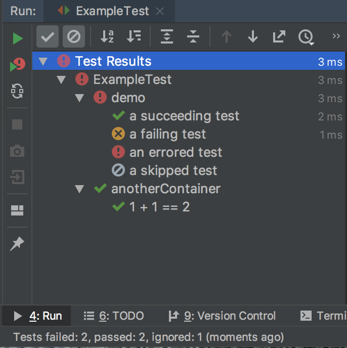
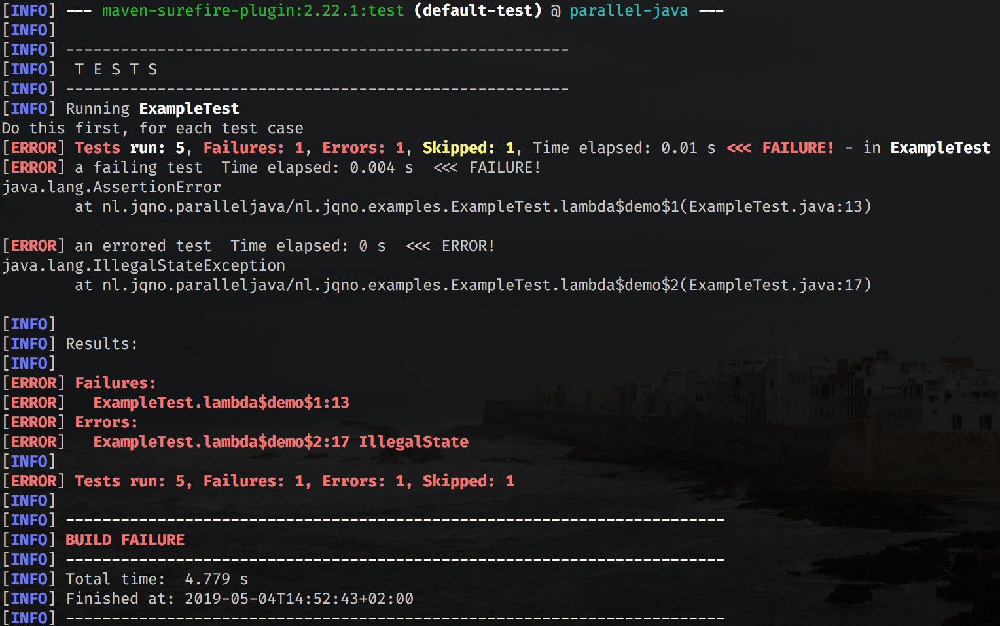

# PicoTest

An ultra-minimal unit-testing framework, based on the JUnit 5 Platform.

PicoTest does not provide an assertion library; you will need to use JUnit, Hamcrest, AssertJ, or something similar.

## How to use:

```java
import nl.jqno.picotest.Test;

public class ExampleTest extends Test {

    public void demo() {
        test("a succeeding test", () -> {
            assert 1 + 1 == 2;
        });

        test("a failing test", () -> {
            assert 1 + 1 == 3;
        });

        test("an errored test", () -> {
            throw new IllegalStateException();
        });

        skip("sometimes you want to skip things", "a skipped test", () -> {
           assert 1 + 1 == 2;
        });
    }

    public void anotherContainer() {
        beforeEach(() -> {
            System.out.println("Do this first, for each test case");
        });
        
        test("1 + 1 == 2", () -> {
            assert 1 + 1 == 2;
        });
    }
}
```

PicoTest also supports `beforeEach()`, `afterEach()`, `beforeAll()` and `afterAll()`.

## Support

PicoTest is supported everywhere that JUnit 5 is supported. This includes IntelliJ and Maven:





## How to add to your project

Ensure the following is in your `pom.xml`:

```xml
<repositories>
  <repository>
    <id>bintray-jqno-picotest-repo</id>
    <url>https://dl.bintray.com/jqno/picotest-repo</url>
  </repository>
</repositories>

<build>
  <plugins>
    <plugin>
      <artifactId>maven-surefire-plugin</artifactId>
      <version>2.22.1</version>
    </plugin>
  </plugins>
</build>

<dependencies>
  <dependency>
    <groupId>nl.jqno.picotest</groupId>
    <artifactId>picotest</artifactId>
    <version><!-- insert latest version number here! --></version>
    <scope>test</scope>
  </dependency>
</dependencies>
```
